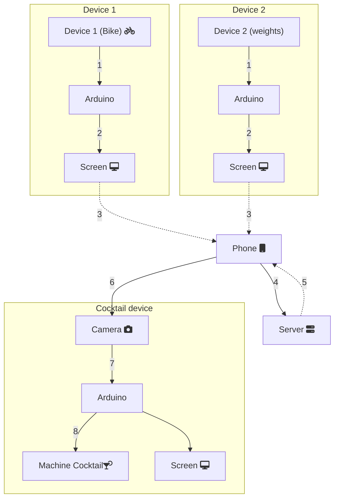

1. L'appareil envoie les informations énergétiques à l'Arduino

2. L'Arduino process les données et affiche le score + un **code** sur l'écran

3. L'utilisateur rentre le **code** sur notre site, à partir de son téléphone
   Un code contient les informations suivantes :

   | 1                                          | 2                                       | 3     |
   | ------------------------------------------ | --------------------------------------- | ----- |
   | Identifiant de la machine (Bike ou Weight) | Identifiant de la commande (nième code) | score |

4. Le code est envoyé sur le serveur

5. Le serveur vérifie le code.  On aura une valeur initialisée à 0 dans la base de données ,pour chacun des appareils. Un code est valide si son identifiant de commande correspond à la valeur à incrémenter, pour l'appareil en question. Si le code est valide, on affiche la liste des sirops en fonction du score et incrémente la valeur

6. L'utilisateur clique sur le produit qu'il désire. Un QR Code s'affiche. Il le montre à la caméra de la machine à cocktail

7. L'Arduino de la machine à cocktail vérifie le code (de la même manière qu'au point 5)

8. Si le code est valide, la machine effectue le sirop demandé